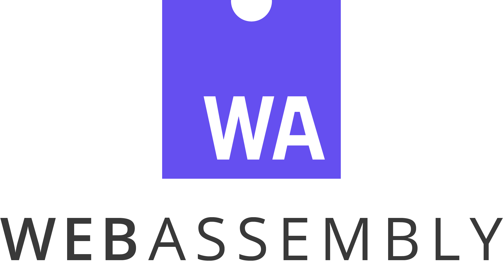
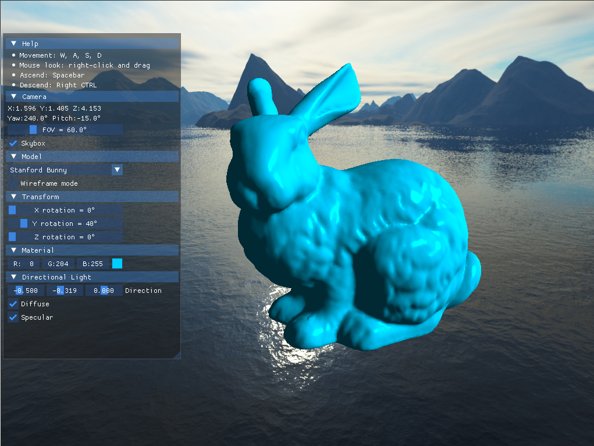

# Real-time 3D renderer with OpenGL 4/WebGL2 written in Rust

[](https://github.com/balintkissdev/3d-renderer-rust/actions/workflows/ci.yml)

> A hardware-accelerated 3D renderer written in Rust. Runs using OpenGL 4.3 as
graphics API on desktop and WebGL2 on WebAssembly.

[Click here for C++ version of this project](https://github.com/balintkissdev/3d-renderer-cpp)

<p align="center">
  
  
  
  
</p>



## Table of Contents

- [Try it out!](#try-it-out)
- [Motivation](#motivation)
- [Features](#features)
- [Requirements](#requirements)
- [Build instructions](#build-instructions)
- [Usage](#usage)
- [Resources](#resources)

## Try it out!

- [Live demo in web browser](https://www.balintkissdev.com/3d-renderer-rust)
- [Windows 64-bit download](https://github.com/balintkissdev/3d-renderer-rust/releases/download/0.3.2/3d-renderer-rust-0.3.2-win64.zip)
- [Linux 64-bit download](https://github.com/balintkissdev/3d-renderer-rust/releases/download/0.3.2/3d-renderer-rust-0.3.2-linux-x86_64.tar.gz)

## Motivation

This project is a demonstration of my expertise to use the Rust programming
language to write cross-platform 3D graphical applications that run both on
desktop (Windows, Linux) and on the web with WebAssembly. The project showcases
confident usage of the following technologies:

- Rust
- 3D graphics programming with OpenGL 4 and WebGL2 (based on OpenGL ES 3.0)
- Immediate mode overlay GUI using [egui](https://crates.io/crates/egui) (as opposed to retained mode GUI frameworks like Qt)
- Building for [WebAssembly](https://webassembly.org/) using [webpack](https://webpack.js.org/)
- HTML bindings into Rust binary
- Advanced `cargo` features (crate patching)

Future additions will include Direct3D, Vulkan rendering backends and additional post-processing effects.

## Features

- 3D model display from `OBJ` file format
- Fly-by FPS camera movement
- Skybox display using cube-map
- Directional light with ADS (Ambient, Diffuse, Specular) lighting (Phong shading)
- Live browser demo
- HTML controls interacting with the 3D scene
- Pure Rust dependencies without relying on C/C++ library bindings

## Requirements

Desktop executable requires an OpenGL 4.3 compatible graphics adapter to run.
Check if your hardware supports OpenGL 4.3 and have the latest graphics driver
installed.

Web browser live demo requires support of WebGL2.

Dependencies are automatically downloaded by `cargo`.

- [cgmath](https://crates.io/crates/cgmath)
- [egui](https://crates.io/crates/egui)
- [glow](https://crates.io/crates/glow)
- [glutin](https://crates.io/crates/glutin)
- [image](https://crates.io/crates/image)
- [tobj](https://crates.io/crates/tobj)
- [wasm-bindgen](https://crates.io/crates/wasm-bindgen)
- [web-sys](https://crates.io/crates/web-sys)
- [winit](https://crates.io/crates/winit)

## Build instructions

1. Make sure you have the latest stable version of Rust and `cargo` installed, following the instructions on
https://www.rust-lang.org/tools/install

2. Clone the repository

  ```sh
  git clone https://github.com/balintkissdev/3d-renderer-rust.git
  cd 3d-renderer-rust
  ```

3. Compile and execute the release build

  ```sh
  cargo run --release
  ```

### WebAssembly build

Web build requires Node.js and `npm` as package manager. The recommended way to install `npm` is using a Node version manager like [nvm](https://github.com/nvm-sh/nvm).

Use `npm` to install Node package dependencies:

```sh
npm install
```

Build the web application (there's no need to install `wasm-pack` separately, because it is automatically downloaded locally by `webpack`):

```sh
npm run build
```

Run the web application by serving it on live server:

```sh
npm run serve
```

You can access the application at `http://localhost:8080`.

## Usage

Use keyboard and mouse to navigate the 3D environment.

- Movement: `W`, `A`, `S`, `D`
- Mouse look: `Right-click` and drag
- Ascend: `Spacebar`
- Descend: `C`

Modify UI controls to change properties of the 3D model display. Browser demo also has HTML controls.

## Resources

- *Utah Teapot* and *Stanford Bunny* model meshes are from [Stanford Computer Graphics Laboratory](https://graphics.stanford.edu/)
    - High poly *Stanford Bunny* model mesh is from https://www.prinmath.com/csci5229/OBJ/index.html
- Skybox texture images are from [learnopengl.com](https://learnopengl.com/Advanced-OpenGL/Cubemaps)

